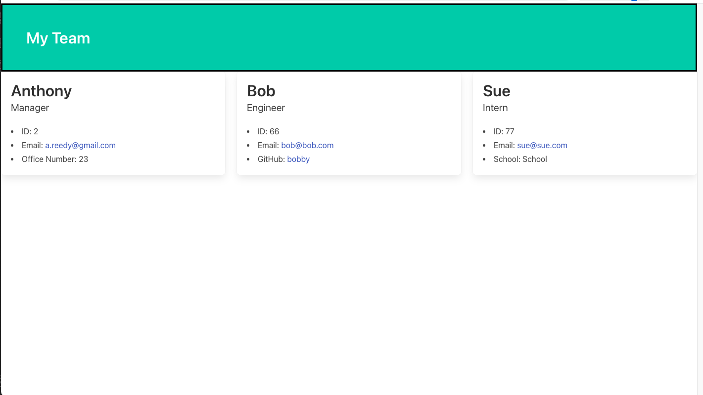

# Team Profile Generator

## Description

This project enabled me to dive deeper into Object Oriented Programming as well as apply what I've learned about running tests. The application uses terminal prompts to give a manager a way to create a web page displaying information on their team. The manager adds their name, employee ID, email address, and Office Number, then has the option to add similar details for each Engineer and/or Intern on their team. Once the application runs it creates an HTML file to display these details on a clean looking web page.

[Link To Repo](https://github.com/asreedy82/team-profile-generator)

## Installation

In order to use this application, node.js needs to be installed on the machine as well as Jest (for testing purposes) and Inquirer. To install Inquirer, first run `npm init -y` then run `npm i inquirer@8.2.4`. To install Jest, run `npm install jest`. After that, it is a good idea (and often necessary) to run `npm install` from terminal before beginning any future sessions. 

  - Link to video demo of app [Screencast Link](need link)

## Usage

The application is designed to generate a web page for a Manager to display their team's basic info, giving them quick access to each member's emails address and GitHub profiles for the engineers.

## Credits

N/A

## License

N/A

### Author: Anthony Reedy